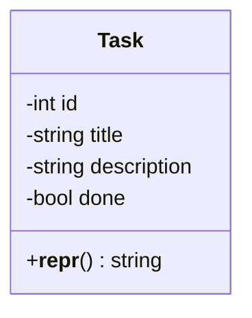
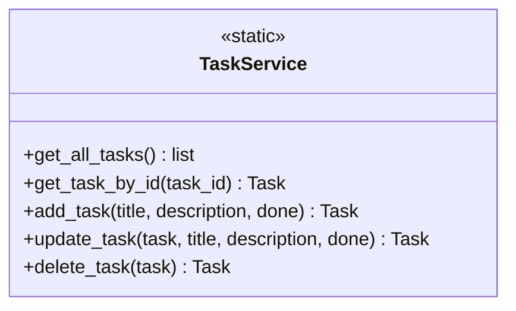
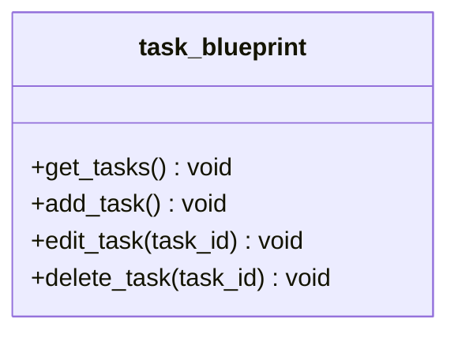
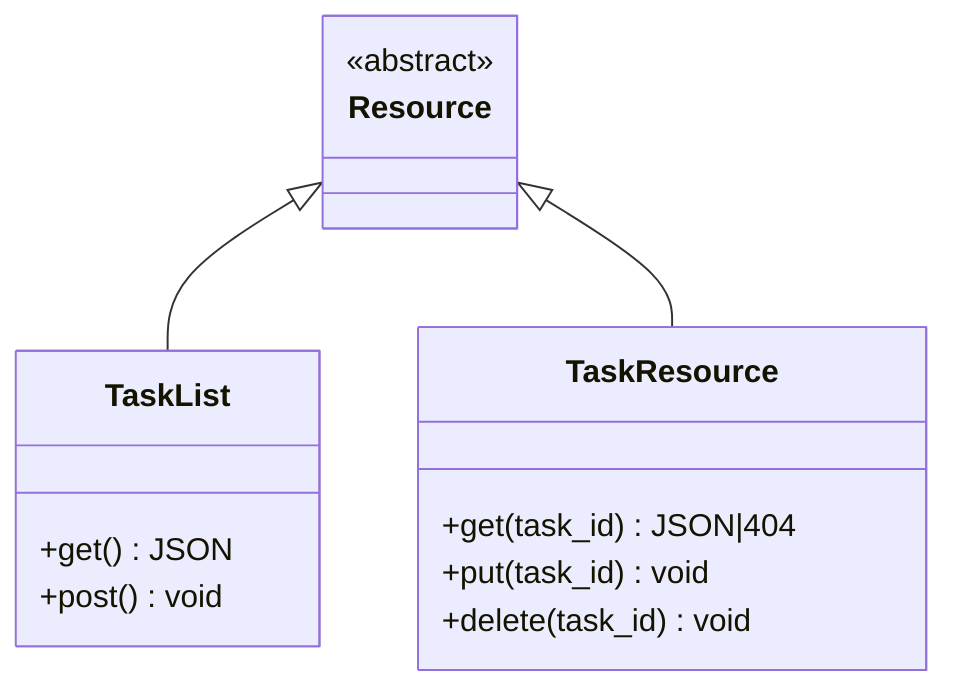
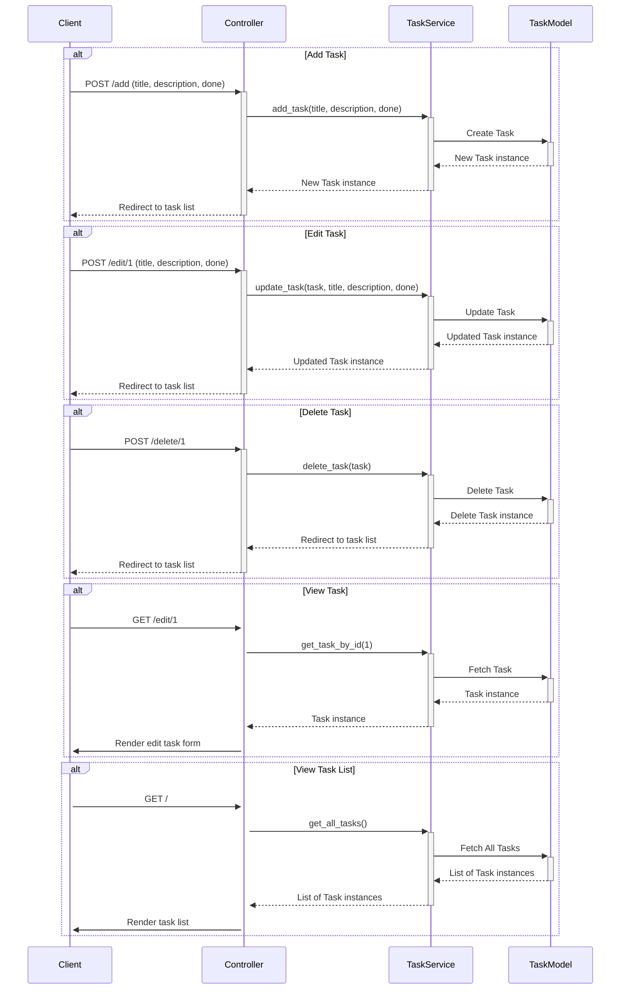
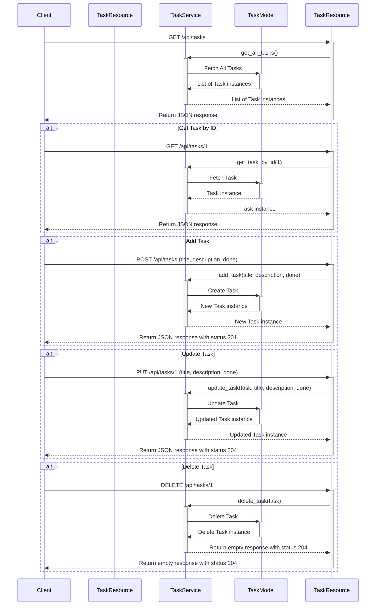
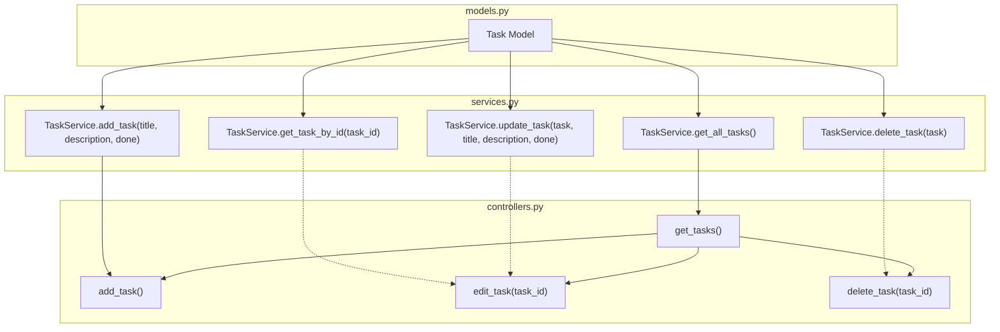
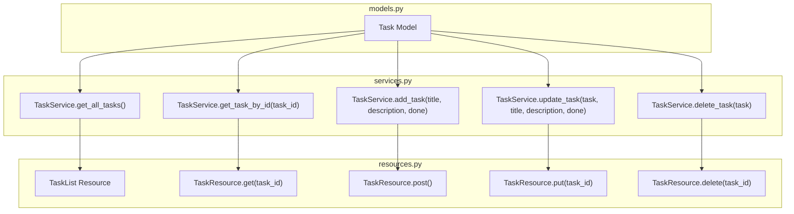

# Task App Overview

## Purpose

The Task App is designed to manage tasks efficiently, providing users with a platform to create, update, delete, and view tasks. It leverages the MVC architectural pattern to separate concerns, making the application easier to manage and scale.

## Running the Application

To see the Task App in action, navigate to the application's directory and run:

```sh
python3 app.py
```

This command starts the application, making it accessible through a web interface where users can manage their tasks.

## How It Works

The application is structured following the MVC (Model-View-Controller) architectural pattern, complemented by a RESTful API module. This structure promotes separation of concerns, making the application more manageable and scalable. Below is an overview of the main components and how they interact with each other, focusing on the files [`services.py`](services.py), [`controllers.py`](controllers.py), [`models.py`](models.py), and [`resources.py`](api/resources.py).

### Model Layer

#### [`models.py`](models.py)

The model layer is responsible for the data logic. It defines the structure of the tasks, including attributes such as task name, description, due date, and status. The `Task` class in [`models.py`](models.py) represents the task entity with properties for `id`, `title`, `description`, and `done`status. This class interacts with the database through SQLAlchemy ORM, facilitating CRUD operations.

##### Class Diagrams

The following class diagram illustrates the structure of the `Task` class:



### Service Layer

#### [`services.py`](services.py-context)

The service layer, implemented in [`services.py`](services.py), contains the `TaskService`class that abstracts the logic for interacting with the database. It provides methods for retrieving all tasks, fetching a task by ID, adding a new task, updating an existing task, and deleting a task. This layer acts as a bridge between the model and the controllers, encapsulating the business logic of the application.

##### Class Diagrams

The following class diagram illustrates the structure of the `TaskService` class:



### Controller Layer

#### [`controllers.py`](./controllers.py)

The controller layer handles the incoming HTTP requests, processes them with the help of the service layer, and returns the appropriate responses. The [`controllers.py`](controllers.py) file defines various functions like `get_tasks`, `add_task`, `edit_task`, and `delete_task` that render templates or redirect to different routes based on user actions. These functions utilize the `TaskService` methods to interact with the database and manipulate task data.

The following sequence diagram illustrates the flow of operations when adding a new task:



### API Module

#### [`resources.py`](./api/resources.py)

In addition to the MVC components, the application includes a RESTful API module for interacting with task data through HTTP requests. The [`resources.py`](./api/resources.py) file defines `TaskList` and `TaskResource`classes, extending the `Resource` class from Flask-RESTful. These classes provide endpoints for listing all tasks, retrieving a single task by ID, and placeholders for creating, updating, and deleting tasks. The API module allows for integration with other systems or applications, extending the app's functionality.

##### Class Diagrams

The following class diagram illustrates the structure of the `TaskList` and `TaskResource` classes:



### View Components

The view layer is responsible for presenting data to the user in a user-friendly manner. It consists of templates that render the tasks in various forms, such as lists or detailed views. The view layer ensures that the user interface is intuitive and responsive.

#### Base Template: [`base.html`](./templates/base.html)

The [`base.html`](.src/templates/base.html) file serves as the foundation for all other templates in the application. It defines the basic HTML structure, including the `DOCTYPE`, `html` and `body` tags, and sets up the viewport and character encoding for the web page. It includes the Bootstrap CSS framework to ensure the application is responsive and has a modern look. The template defines a container `div` where the title of the application, "Task Manager," is displayed. It also includes a `block` named `content`, which is a placeholder for the content that will be injected by other templates extending this base template.

#### Adding a Task: [`add_task.html`](./templates/add_task.html)

The [`add_task.html`](./templates/add_task.html) template extends the [`base.html`](./templates/base.html) template and provides a form for adding a new task. It uses Flask-WTF to generate a form that includes fields for the task's title, description, and a checkbox to mark the task as done. Each field is accompanied by a label, and the form is styled using Bootstrap classes to maintain a consistent and user-friendly interface. The form uses a POST method to submit the data.

#### Editing a Task: [`edit_task.html`](./templates/edit_task.html)

The [`edit_task.html`](./templates/edit_task.html) template is very similar to the [`add_task.html`](./templates/add_task.html) template in structure and purpose but is used for editing existing tasks. It extends the [`base.html`](./templates/base.html) template and also generates a form with fields for the task's title, description, and completion status. The form is pre-filled with the current values of the task being edited, allowing the user to update any of the task's details. Like the add task form, it uses Bootstrap for styling and a POST method for form submission.

#### Task List: [`task_list.html`](./templates/task_list.html)

The [`task_list.html`](./templates/task_list.html) template extends the [`base.html`](./templates/base.html) template and displays a list of tasks. It provides an "Add Task" button that links to the form for adding a new task. Each task is listed with its title and description, and tasks that are marked as done display a "Done" badge. Each task also has an "Edit" button that links to the edit form for that task, and a "Delete" button that submits a form to delete the task. The tasks are displayed in a list group, with Bootstrap styling applied for a clean and organized appearance.

## Interaction Flow

1. **User Requests**: Incoming HTTP requests are routed to the appropriate controller functions in [`controllers.py`](./controllers.py) or API endpoints in [`resources.py`](./api/resources.py).
2. **Controller/API Processing**: These functions/endpoints process the request, calling the relevant methods in the [`TaskService`](./services.py) class from [`services.py`](./services.py) to perform operations on the data.
3. **Service Layer**: [`TaskService`](./services.py) interacts with the [`Task`](./models.py) model in [`models.py`](./models.py) to execute database operations through SQLAlchemy.
4. **Response Generation**: The controller functions render templates or redirect to other routes with the processed data, while the API endpoints return JSON responses.

### App Sequence Diagram

The following sequence diagram illustrates the flow of operations for the app:



### API Sequence Diagram

The following sequence diagram illustrates the flow of operations for the API:



### App Interaction Flowchart

The following flowchart illustrates the interaction between the components of the Task App:



### API Interaction Flowchart

The following flowchart illustrates the interaction between the components of the Task App's API:



This architecture ensures a clear separation of concerns, with each layer focusing on its specific role, thereby enhancing the maintainability and scalability of the application.

## Conclusion

The Task App is a comprehensive solution for task management, built using the MVC architectural pattern. Its separation of concerns facilitates maintenance and further development, while the inclusion of an API module offers extended capabilities for users and developers alike.
